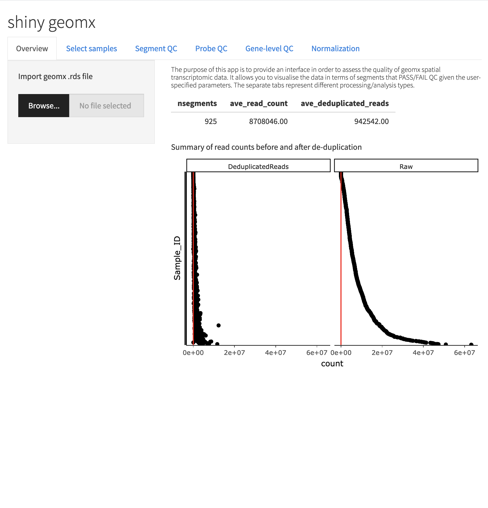
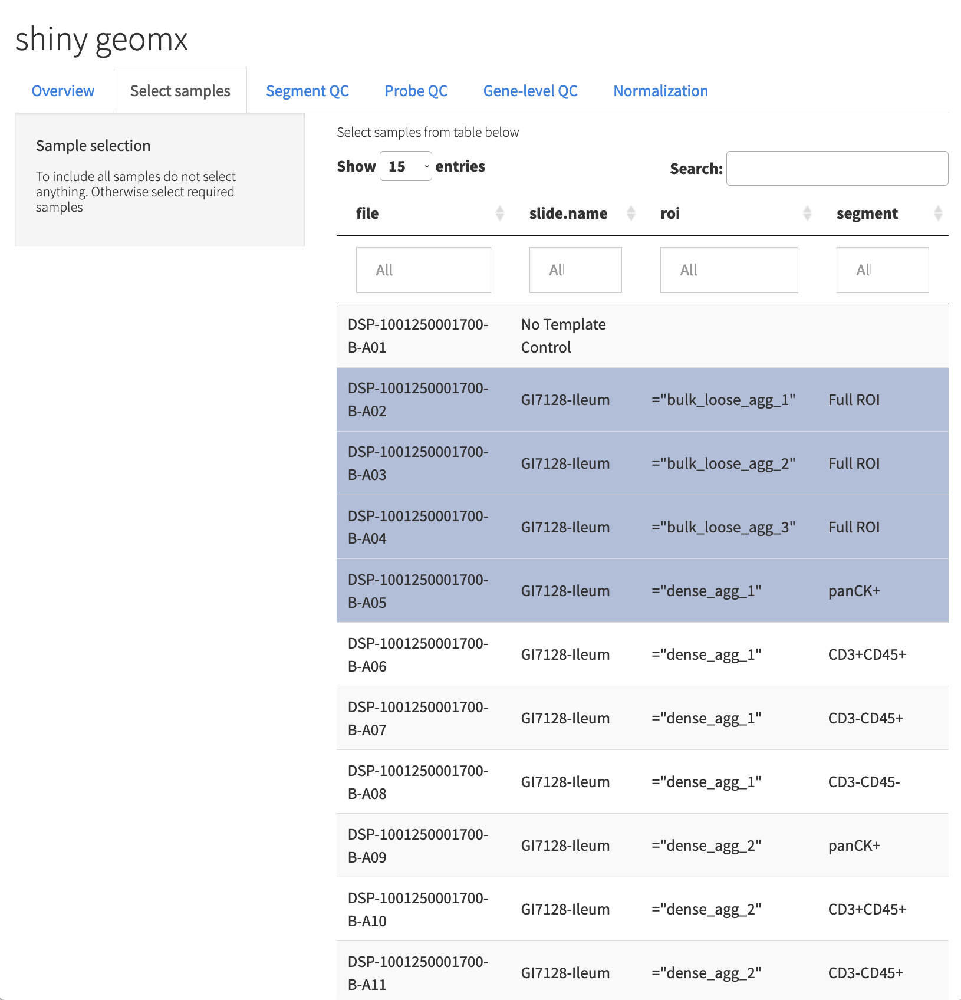
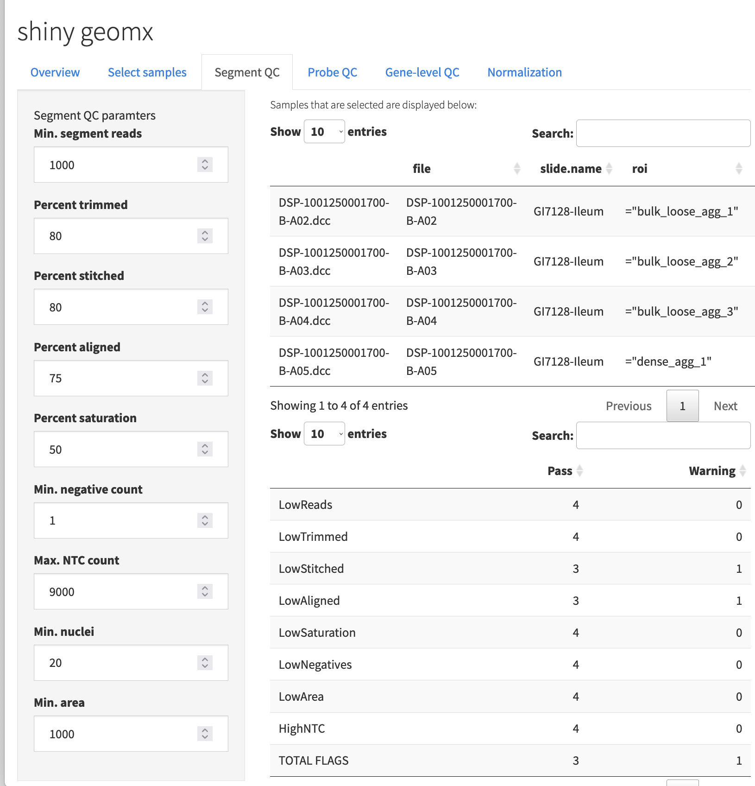
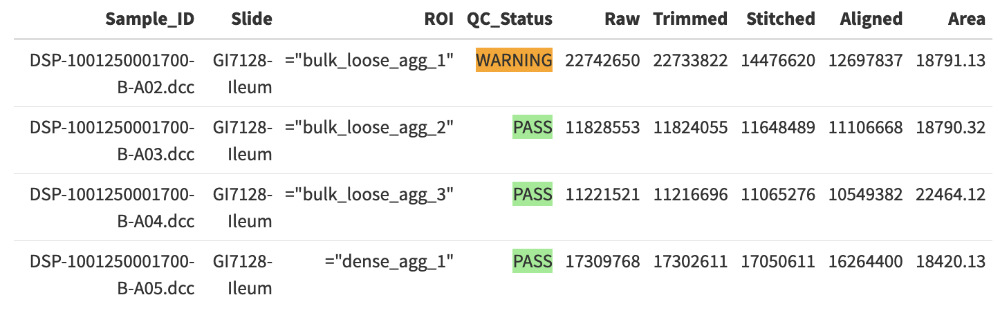
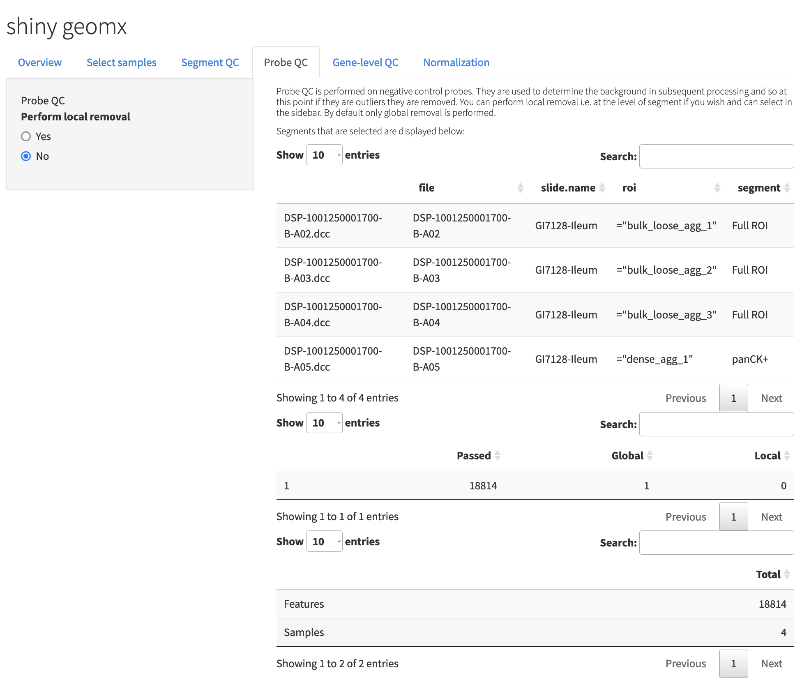
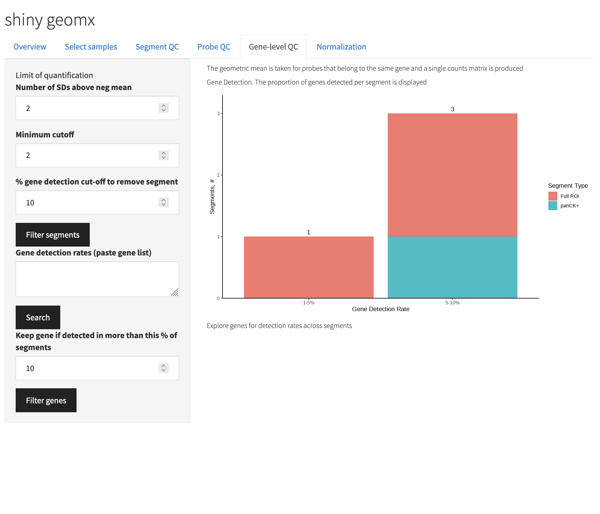
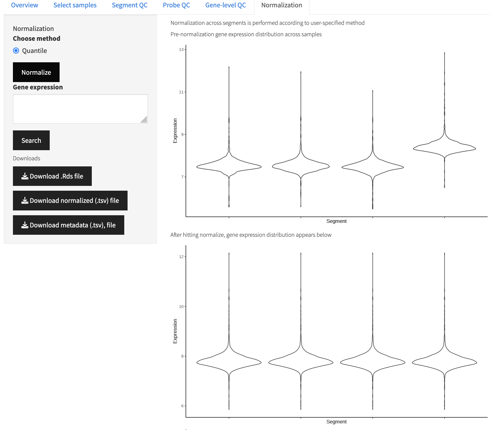
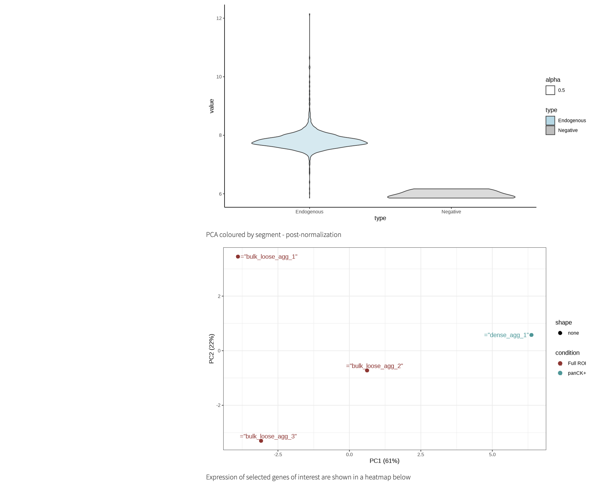
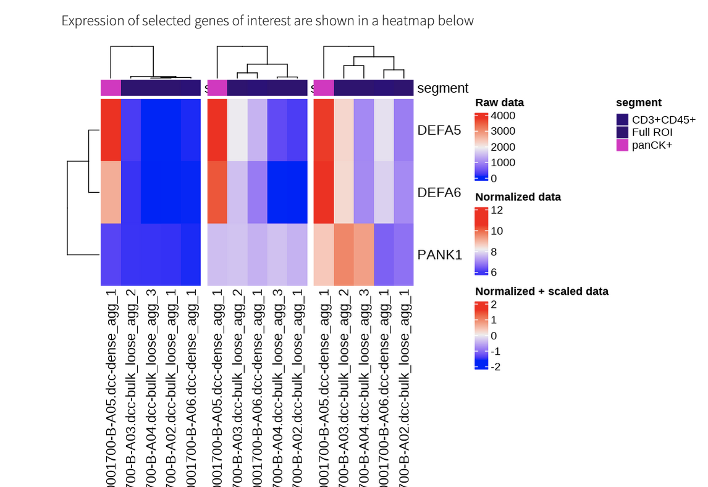

# Shiny geomx

## Overview

This app was designed to take the output from geomxngspipeline (.dcc files) along with annotations and .pkc files that are aggregated into a NanoStringGeoMxSet. The app wraps functionality of [geomxTools](https://bioconductor.org/packages/devel/workflows/vignettes/GeoMxWorkflows/inst/doc/GeomxTools_RNA-NGS_Analysis.html) in order for users to perform segment and gene quality control and visualise their data before downstream data analysis.


## Dependencies

### R version

R >= 4.2.1 

### R packages

ComplexHeatmap
dplyr
DT
formattable
GeomxTools
ggplot2
ggrepel
plotly
preprocessCore
shiny
shinythemes
shinycssloaders
shinyBS
tidyr

## Installation

Once the correct R version and R packages have been installed, clone this repository.

## Running the app

To run the app, start R/RStudio and run the app with:

```shiny::runApp("<path-to-repository>/R/app.R")```

### Upload file

Once the app is open in a browser window you will see the first tab. This displays an overview of read counts in both the raw data and post duplication (i.e. performed using the geomxngspipeline). At this stage you can upload your NanoStringGeoMxSet object that is read from an .Rds file. 



### Select samples

The second tab in the app allows you to select the samples (segments) that you want to include in the QC and normalization procedures. To keep all samples simply leave this section as is, else you can click on samples in the table to include them.



### Segment QC

The segment QC tab provides you with a broad overview of segments that pass various QC metrics. The default values for these metrics are those that are recommended by Nanostring although you can change them to observe effects on pass/warnings. To get additional information on the parameters in the left sidebar, you can hover over the parameter. The first table in this tab shows you the segments that are included based on your selections. The second table provides an overview of the number of segments that pass the QC based on the parameters specified. The third table shows each segment chosen and whether or not it passes QC. A warning suggests that downstream analysis of the segment should be done cautiously.




### Probe QC

The probe QC tab assesses the performance of negative control probes. These are used to determine limits of quantification etc for endogenous probes and so it is important to remove those that are not performing well. By default this is done globally i.e. if a negative control probe is identified as poor, then it is removed from all segments in downstream analysis.



### Gene-level QC

The gene-level QC tab allows you to define the limit of quantification and the number of standard deviations above that limit you will allow a gene to be called as expressed. The top stacked bar chart displays the number of segments that fall into different bins of % expressed genes/probes. In the example below you can see that one segment has 1-5% of genes expressed at 2 SD above the geometric mean of the negative control probes. At this stage you can remove additional segments that are of potential low quality by specifyingto remove segments if they have fewer than a specific % of endogenous probes detected and clicking 'Filter segments'.

You can get more information on specific genes that are detected in each segment by pasting a gene list into the 'Gene detection rates' text box. Once you click 'Search' you will be able tosee how many segmentsthese genes are detected in which is also visualised as a heatmap. Genes that are not robustly expressed can be removed at this point by specifying the % of segments a gene must be detected in in order to take it forward. Click 'Filter genes' to perform this step and you will see the number of segments and genes that remain after filtering. 



### Normalization

Normalization aims to correct for inter-segment variability in expression. The most robust way to do this is to perform quantile normalization (default in the app) although other methods are supported. Expression distributions of raw data are displayed for each segment in the top plot. Once you click 'Normalise', the normalised expression distributions will be displayed. 



Also displayed are plots that show the expression distribution of endogenous probes vs negative probes and a PCA plot.



In this tab you can also serach for genes of interest in the text box in order to visualise their expression across segments. Expression is displayed in heatmaps of raw count, normalised expression and normalised + row scaled expression. 



